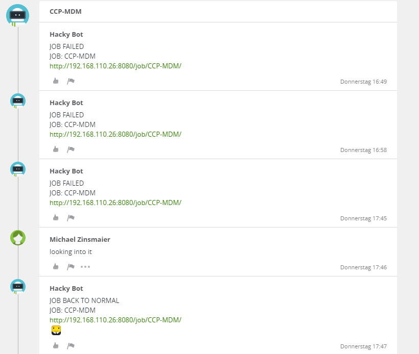
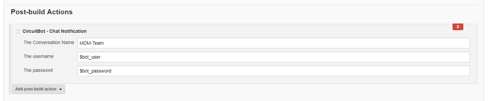
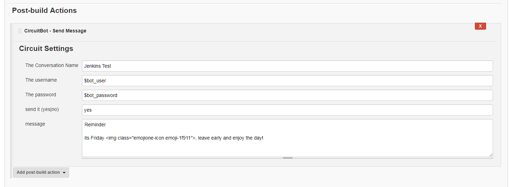

# CiBot
Circuit Continuous Integration Bot for Jenkins

## Features

#### NotificationBot
- equivalent to Jenkins E-Mail Notification plugin
- searches the history of a conversation for a topic matching the job name
- or creates a new topic if nothing shows up
- posts the job status if the job fails or if it recovers and is back to stable

  
  

#### SendMessageBot
- sends a message to a conversation
- at a given time (using Jenkins cron config)
- if a given condition is met (bind a variable to the send field)

  
  

#### mixed
- proxy support for HTTP proxies
- smiley support using Circuit image tags

## how to use
 tbd.
 
install instructions
images
configuration
credentials plugin
public test account
company acccount from your admin

## API whishlist
-	there should be a REST call to query subjects/topics  on a conversation, the only thing that works right now is to search for the last 100 text items and then filter for text items with a subject field
- there should be a way to query conversations by title, the full text search brings them up but it triggers as well if the search tag is in the text messages
-	better REST responses e.g. “404 conversation with ID 123 not found”

