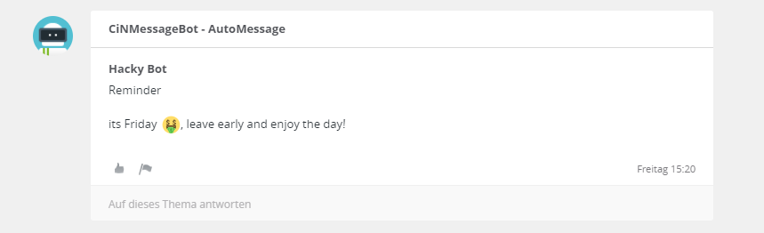

# CiBot
Circuit Continuous Integration Bot for Jenkins

## Features

#### NotificationBot
- equivalent to Jenkins E-Mail Notification plugin
- searches the history of a conversation for a topic matching the job name
- or creates a new topic if nothing shows up
- posts the job status if the job fails or if it recovers and is back to stable

  
  

#### SendMessageBot
- sends a message to a conversation
- at a given time (using Jenkins cron config)
- if a given condition is met (bind a variable to the send field)

  
  

#### mixed
- proxy support for HTTP proxies
- smiley support using Circuit image tags

## How to use

Following steps describe how to integrate the CIBot into your Jenkins.
 
 #### Build
 
Ensure you have JDK Maven and Git installed

Clone the repository:
git clone https://github.com/MichaelZinsmaier/CiBot

Build plugin:
mvn install

#### Install Plugin

To install the plugin copy cibot.hpi to JENKINS_HOME/plugins. Restart the Jenkins afterwards.

OR

1. Navigate to the Manage Jenkins > Manage Plugins page in the web UI.
2. Click on the Advanced tab.
3. Choose the .hpi file under the Upload Plugin section.
4. Upload the plugin file.

Refer to the official Jenkins documentation how to handle plugins if you need support: https://jenkins.io/doc/book/managing/plugins/

## Configure Plugin

Navigate to Jenkins > configuration > system > "Circuit Settings for Notification" / "Circuit Settings for Messaging".
Adapt configuration to your needs. Leave empty if not Proxy is required.

Navigate to Job > configuration > add CircuitBot as a new Post-Build-Action
- The Conversation ID: If you are using Ciruit from Web copy the ID from the URL. If you are using the Circuit client right-click on the conversation, select copy link to conversation and extract the ID.
- The username: Username of Jenkins Bot.
- The password: Username of Jenkins Bot.
Messaging Plugin only:
- Send it: yes or no. Defines if Bot is enabled or disabled.
- Message: Content of the message.

#### Obtain Bot Account

Either to to Circuit Developer Community and request a sandbox:
https://circuit.github.io/

OR 

Contact your company Circuit admin.

## API whishlist
-	there should be a REST call to query subjects/topics  on a conversation, the only thing that works right now is to search for the last 100 text items and then filter for text items with a subject field
- there should be a way to query conversations by title, the full text search brings them up but it triggers as well if the search tag is in the text messages
-	better REST responses e.g. “404 conversation with ID 123 not found”

